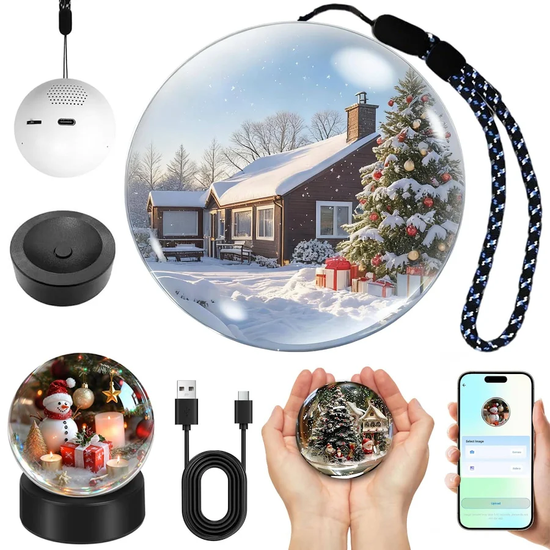

# memoryball-studio

Ever gifted (or received) a Memory Orb — that little crystal ball with the round 480×480 display — only to find the manufacturer app crops every photo dead-center? Heads chopped off, faces pushed to the edge, memories ruined. memoryball-studio fixes that: point it at a whole photo folder and get **face-centered 480×480 crops** out, ready for upload — entirely on your machine.

memoryball-studio is a CLI and GUI tool for automatically cropping photos and videos to square 480×480 pixels. Faces are detected with MediaPipe, and the crop follows the face thanks to smoothing. Videos are encoded via ffmpeg, with audio optionally preserved.

## What is a Memory Orb?



A **Memory Orb** is a palm-sized crystal ball with a built-in round display: photos and short videos are uploaded via app/WiFi and play as a glowing memory gallery inside the ball — a popular gift for weddings, birthdays, or Christmas.

➡️ **Buy a Memory Orb:** e.g. [on Amazon (2.76″ Crystal Video Orb, WiFi upload)](https://www.amazon.com/Memory-Orb-Ball-Personalized-Anniversary/dp/B0FRLTJ9NM) — comparable models are also available on AliExpress/Etsy. *(No affiliate link.)*

## Features

* Batch processing for images (JPG/PNG/HEIC/WebP) and videos (MP4/MOV/MKV/AVI)
* Automatic face detection with MediaPipe Face Detection (falls back to OpenCV Haar cascades if MediaPipe is unavailable)
* Bounding-box smoothing via exponential moving average
* Fallback: safe center crop, optionally with padding
* Video export via ffmpeg including audio control
* Multithreading for images, convenient Tkinter GUI with preview
* Manual per-image crop adjustment with preview

## Installation

Prerequisites: Python 3.10 or newer and ffmpeg/ffprobe on your system.

```bash
ffmpeg -version
```

If ffmpeg is missing:

* **Windows**: `choco install ffmpeg` or unpack the ZIP from [ffmpeg.org](https://ffmpeg.org) and add it to PATH
* **macOS**: `brew install ffmpeg`
* **Linux**: `sudo apt install ffmpeg`

Install the project:

```bash
git clone <repo>
cd memoryball-studio
pip install -r requirements.txt
```

## CLI usage

```bash
python main.py --input "C:\in" --output "C:\out" --mode auto --size 480 --min-face 0.12 \
  --quality 90 --threads 4 --fps keep --image-format jpg --video-ext mp4 --face-priority largest
```

Key parameters:

| Parameter | Description |
|-----------|-------------|
| `--input` | File or folder (recursive) |
| `--output` | Output folder (created if missing) |
| `--mode` | `auto`, `center`, `manual` (manual uses `--crop-*` as starting values) |
| `--size` | Target edge length (default 480) |
| `--fps` | Number or `keep` |
| `--quality` | Image quality (1–100) |
| `--crf` | Video CRF (default 20) |
| `--preset` | ffmpeg preset (default `medium`) |
| `--min-face` | Minimum face area relative to the smallest image edge |
| `--face-priority` | Selection when multiple faces are found (`largest`/`center`/`all`) |
| `--detection` | Detection mode (`face`/`person`/`none`) |
| `--threads` | Threads for images |
| `--pad` | Optional padding (e.g. `0.05` for 5%) |
| `--image-format` | `jpg`, `png`, or `webp` |
| `--video-ext` | Currently `mp4` |
| `--keep-audio` | `on`/`off` |
| `--log-level` | `info` or `debug` |

### Examples

Process images only:

```bash
python main.py --input ./bilder --output ./export --image-format jpg --no-face
```

Videos only, keeping audio:

```bash
python main.py --input ./videos --output ./export --fps keep --keep-audio on --threads 2
```

Mixed folder with padding and reduced FPS:

```bash
python main.py --input ./medien --output ./export --pad 0.05 --fps 30 --quality 95
```

## GUI

The GUI starts automatically when `main.py` is opened without parameters (e.g. via double-click). Alternatively, it can be launched explicitly from the console:

```bash
python main.py --gui
```

**Workflow:**

1. Choose an input folder — the output folder is automatically suggested as `Converted <folder name>`.
2. Select images in the list, review the automatic detection, and adjust with the zoom and position sliders if needed.
3. Videos are processed automatically and use the same settings.
4. Click "Convert" to create the output; progress is displayed.

### Launch via double-click

* Make sure Python 3.10+ is installed and `python` is on your `%PATH%`.
* Launch the tool via `start.py` (double-click or `python start.py`).
  * On first launch, the script first tries to start the application directly.
  * If that fails, it automatically creates a virtual environment in the project folder,
    installs all dependencies from `requirements.txt`, and then starts again.
  * Once the launch succeeds, subsequent runs only start the application —
    a reinstall only happens if the startup code returns an error.
* Even when launching directly via `main.py`, errors are still logged to
  `startup-errors.log`.

## Performance tips

* Increase `--threads` for many images (consider your CPU core count)
* Use faster ffmpeg presets (`--preset fast`) for quicker video export
* Square sources take a fast path: just a resize instead of a crop

## Troubleshooting

* **HEIC files are not read** — Make sure `pillow-heif` is installed and the file is not DRM-protected.
* **Corrupted metadata** — ffmpeg/ffprobe may abort on broken files. The application logs warnings and keeps processing the rest.
* **Face not detected** — Don't raise `--min-face` too much, use `--face-priority center`, or disable detection (`--no-face`).
* **`ModuleNotFoundError: No module named 'cv2'`** — OpenCV is not installed. Run `python -m pip install -r requirements.txt` in your project folder.
* **`pip install mediapipe` fails on Windows/Python 3.12** — Installing the requirements still works. In that case the app automatically uses OpenCV Haar cascade detection.

## Tests

Simple test run (creates dummy images/videos and checks the output sizes):

```bash
pytest
```

## Step by step, locally

1. Install ffmpeg (see above)
2. Clone the repository
3. `pip install -r requirements.txt`
4. Example: `python main.py --input "D:\Rohmaterial" --output "D:\MemoryBall" --size 480 --fps keep --threads 6 --min-face 0.1`

<!-- PORTFOLIO-LINKS:START -->
## More open-source tools by Moritz Voigt

- **[secret-paste](https://github.com/MoritzV42/secret-paste)** — Paste API keys & tokens to your AI coding agent without ever putting them in the chat transcript. Local-only, cross-platform.
- **[push-to-clip](https://github.com/MoritzV42/push-to-clip)** — Copy text, files, or piped output to your system clipboard, from one command, on any OS.
- **[memoryball-studio](https://github.com/MoritzV42/memoryball-studio)** — Batch-prep a whole photo folder for the Memory Orb display ball: auto-cropped, face-aware, the right format — locally. *(this repo)*
- **[ingpad](https://github.com/MoritzV42/ingpad)** — The engineer's scratch pad: solve technical exercises on one canvas with per-step Given / Sought / Approach, stylus fields, and an AI tutor.

All MIT-licensed, free, built in public → **[moritzvoigt.infinityspace42.de](https://moritzvoigt.infinityspace42.de)**
<!-- PORTFOLIO-LINKS:END -->
